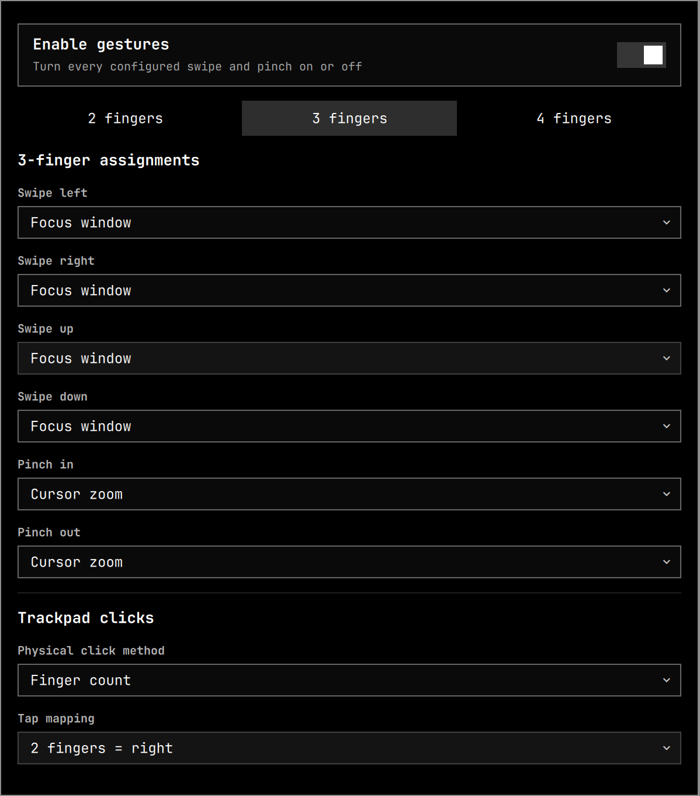

# Omarchy Trackpad Gestures

A Quickshell bar widget for configuring Hyprland trackpad gestures on Omarchy.



The popup configures 2-, 3-, and 4-finger swipes and pinches, toggles all gestures, changes click/tap mappings, and assigns a trackpad click to screenshots or screen recording. Changes persist in `~/.config/omarchy/shell.json` and apply live through a generated `~/.config/hypr/gestures-generated.lua` file.

## Requirements

- Omarchy 4 or newer
- Hyprland 0.55 or newer with Lua configuration
- `git` and `jq`

## Install

```bash
omarchy plugin add https://github.com/mpweaver/omarchy-trackpad-gestures --yes
~/.config/omarchy/plugins/user.trackpad-gestures/install.sh
```

Omarchy manages the repository checkout. The second command performs the additional Hyprland integration that a standard bar widget does not need: it backs up `~/.config/hypr/input.lua` and `~/.config/omarchy/shell.json`, adds the plugin to the right side of the bar, and reloads Hyprland. It is safe to run again.

## First-run preset

- All two-, three-, and four-finger swipe and pinch gestures: none
- One-finger tap: left-click
- Two-finger tap: right-click
- Three-finger tap: screenshot capture
- Screenshot editor: off

The Relative workspace action uses discrete numeric steps: swipe right advances `+1` and swipe left goes back `-1`. It moves strictly in workspace-ID order, including empty workspaces, without the stuck state of Hyprland's continuous workspace action. A live motion threshold dispatches the step before finger release so workspace changes remain responsive.

Every value can be changed from the popup after installation.

## Capture warning

Trackpads expose finger clicks as ordinary mouse buttons. Assigning two-finger click or the lower-right button area to capture replaces normal right-click. Assigning three-finger click replaces normal middle-click.

When the screenshot-editor toggle is enabled, the plugin uses `omarchy-screenshot-edit` if installed and otherwise opens Omarchy's standard smart screenshot flow.

## Update

```bash
omarchy plugin update user.trackpad-gestures --yes
~/.config/omarchy/plugins/user.trackpad-gestures/install.sh
```

## Uninstall

```bash
~/.config/omarchy/plugins/user.trackpad-gestures/uninstall.sh
omarchy plugin remove user.trackpad-gestures --yes
```

Run the cleanup script first so the generated Hyprland configuration is removed before Omarchy deletes the plugin directory.

## License

MIT
